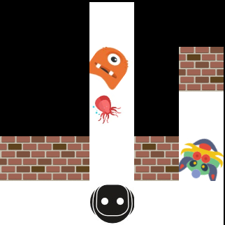

   


This repository contains a collection of simulators for Reinforcement Learning research.

|**Difficulty**|**Name**|**Description**|**Thread-compatible?***|**Optional?**|**Policy**|**Teacher?**|
|:-----|:--------------|:---------------|:---------------|:---------------|:------|:------|
|Easy|[**SimpleGame**](games/simple_game/README.md)|A simple 1D array-walking game.|Yes|No|Discrete|No|
|Easy, Medium|[**SimpleRace**](games/simple_race/README.md)|A simple synthetic car racing game.|Yes|No|Discrete|No|
|Medium, Hard|[**Atari**](games/arcade/README.md)|Wrappers for the Arcade Learning Environment ([ALE](http://www.arcadelearningenvironment.org/)) environment. For stability, we use a fork version.|Yes|Yes|Discrete|No|
|Medium, Hard|[**XWorld2D**](games/xworld/README.md)|A 2D world for an agent to learn vision and language abilities.|No|No|Discrete<br>Continuous|Yes|
|Hard|[**XWorld3D**](games/xworld3d/README.md)|A 3D world for an agent to learn vision and language abilities. (*WIP; a preliminary version without documentation is available.*)|No|Yes|Discrete<br>Continuous|Yes|


(*If yes, then multithreading can be used; otherwise multiprocessing is needed.)

# Architecture
XWorld features a *teacher* infrastructure implemented as a scheduler of multiple Finite State Machines (FSMs). The idea is that given the environment, the teacher can propose a task sampled (by some heuristics) from a task set. Each task - formulated as an FSM - has several stages, and the teacher does different things in different stages. The transition from one stage to another is determined by the envionment state, e.g., whehter the agent is idle or whether it has achieved the goal. Each stage returns several things including the next stage and the teacher's action. Currently, we define language (strings) as the teacher's sole action. However, the teacher is able to change the environment (e.g., adding/deleting objects, changing the map size, etc.) within each stage.


The above figure illustrates the architecture. The motivation is to let the users flexibly write simple Python scripts to configure the environment maps and tasks.

Currently, the teacher is only incorporated into XWorld2D and XWorld3D.

# Requirements
* Compiler: GCC 4.8 or above
* CMake: CMake 3.0 or above
* Python: Python 2.7

# Dependencies
The following softwares must be installed before building XWorld.

[Boost](http://www.boost.org/),
[Glog](https://github.com/google/glog),
[GFlags](https://github.com/gflags/gflags),
[GTest](https://github.com/google/googletest),
and [Python](https://www.python.org/)

In Ubuntu 14.04 and 16.04, you can do
```
sudo apt-get install libboost-all-dev libgflags-dev libgoogle-glog-dev libgtest-dev python-dev
```

# Build
First get this git repository
```
git clone https://github.com/PaddlePaddle/XWorld
```

Suppose the directory is `xworld_path`, then do
```
cd <xworld_path>
mkdir -p build
cd build
cmake [<optional parameters>] ..
```
For example,
```
cd ~/XWorld; mkdir build; cd build
cmake ..
```

Finally, in the build directory do
```
make
make test
```

By default, XWorld only builds the first three games: SimpleGame, SimpleRace, and XWorld2D. Optionally, you can install [Atari](http://www.arcadelearningenvironment.org/) by:

```
cmake -DWITH_ATARI=ON ..
```
which will automatically download and build Atari.

# Usage
## Python interface
We provide a set of simple Python APIs for interacting with the simulators. After building XWorld, you need to export the path of the python module:
```
export PYTHONPATH=<xworld_path>/python:$PYTHONPATH
```
You can add the above line to ~/.bashrc to avoid doing the export in the future.

To get started, several examples of the simulator Python APIs can be found in
```
<xworld_path>/python/examples
```

## C++ interface
Alternatively, several C++ examples (run the .sh scripts inside) can be found in
```
<xworld_path>/examples
```
These examples use the individual class constructors to create games. However, we also provide a unified simulator interface for creating games in a more convenient way (like in Python). A demo of the unified C++ simulator interface for multi-process simulation can be found in
```
<xworld_path>/examples/demo_interface.cpp
```
Generally, C++ APIs are more flexible but expose more details compared to the Python APIs.

## Flags of a game
Option flags are passed into a game via different ways for the two interfaces:

* Python: you need to provide the flags when creating the game as the arguments.
* C++: you need to set the flags via GFlags in the command line.

For descriptions of the flags of a game, please take a look at the README file under the game directory.

# Citations
If you use XWorld2D for research, consider citing

* Haonan Yu, Haichao Zhang, Wei Xu, [*Interactive Grounded Language Acquisition and Generalization in a 2D World*](http://upplysingaoflun.ecn.purdue.edu/~yu239/papers/iclr2018.pdf), ICLR, 2018.
* Haichao Zhang, Haonan Yu, Wei Xu, [*Listen, Interact and Talk: Learning to Speak via Interaction*](https://arxiv.org/abs/1705.09906), NIPS workshop on Visually-Grounded Interaction and Language, 2017.

If you use our wrappers of the third-party simulators, please follow their original guide for citation.

# License
This repository has the Apache2.0 license, except that the third-party simulator ALE has its own license.
