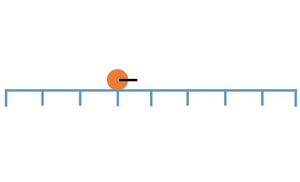

# Simple Game


## Game description
A synthetic simple game. The agent moves along a 1D array. The agent starts at the middle of the array. It has two actions in each step: move left of right. Each move has a reward determined by MOVE_REWARD (-0.1). There are two rewards at both ends of the array. The left end has reward DEST_REWARD (4.0). The right end has reward DEST_REWARD/2 (2.0). The game ends if the agent arrives at either end. The optimal policy is to always move to the left.

## Create
* Python name: ```simple_game```
* C++ constructor name: ```SimpleGame```
* Name for the unified C++ simulator interface: ```simple_game```

## Flags
|**Name**|**Description**|
|:-------|:---------------|
|```array_size```|The array size. (Default: 0)|