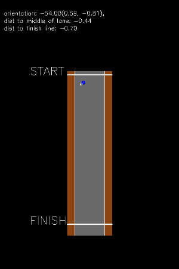

# Simple Race
 

## Game description
A car drives on a track which can be either straight or circular. For the straight track, the car needs to drive from top to bottom without hitting the left or right boundaries of the track. For the circular track, the car needs to stay alive as long as possible.

## Create
* Python name: ```simple_race```
* C++ constructor name: ```SimpleRacegame```
* Name for the unified C++ simulator interface: ```simple_race```

## Flags
|**Name**|**Description**|
|:-------|:---------------|
|```pause_screen```|Pause the screen when show_screen() is called, until any key is pressed. (Default: false)|
|```track_type```|The track type: circular track ("circle") or straight track ("straight"). (Default: "straight")|
|```track_width```|The width of the track. (Default: 20.0)|
|```track_length```|The length of the track, if ```track_type``` is "straight". (Default: 100.0)|
|```track_radius```|The radius of the circluar track, if ```track_type``` is "circle". (Default: 30.0)|
|```race_full_manouver```|Whether to allow turning and moving forward/backward at the same time (true) or not (false). (Default: false)|
|```random```|Whether to have random start location and facing direction (true) or not (false). (Default: false)|
|```difficulty```|The "easy" level provides negative rewards when moving away from the center line of the track, and the "hard" level only provides rewards when out-of-boundary or reaching finish line. (Default: "easy")|
