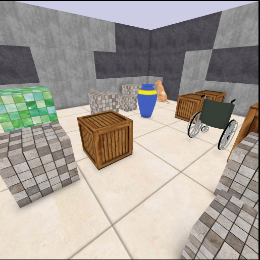

# XWorld3D
## 

## Game description
*This game is not officially made public yet.*

## Dependencies

Install [FFmpeg](https://www.ffmpeg.org/) and [TinyXML](http://www.grinninglizard.com/tinyxml/):

```bash
sudo apt install ffmpeg libtinyxml-dev
```
For installing ffmpeg on Ubuntu 14.04, you need to do:
```bash
sudo add-apt-repository ppa:mc3man/trusty-media
sudo apt-get update
sudo apt-get install ffmpeg
```

Roboschool requires gcc 5.x. On Ubuntu 16.04, this requirement is already satisfied. On Ubuntu 14.04, you need to do
```bash
sudo add-apt-repository ppa:ubuntu-toolchain-r/test
sudo apt-get update
sudo apt-get install gcc-5 g++-5
```
Note: you don't have to set gcc 5.x as the default compiler.

## Qt
Install Qt 5.5:
```bash
cd /tmp/
wget https://download.qt.io/archive/qt/5.5/5.5.1/qt-opensource-linux-x64-5.5.1.run
chmod 755 qt-opensource-linux-x64-5.5.1.run
sudo ./qt-opensource-linux-x64-5.5.1.run
rm -f qt-opensource-linux-x64-5.5.1.run
```
(In the GUI installer, select "skip" for the account, and use the default installation settings.)
Suppose the location of Qt is `[qt_path]`. Add the following lines to your `~/.bashrc`:
```bash
(in ~/.bashrc)
export PKG_CONFIG_PATH=[qt_path]/5.5/gcc_64/lib/pkgconfig:$PKG_CONFIG_PATH
export LD_LIBRARY_PATH=[qt_path]/5.5/gcc_64/lib:$LD_LIBRARY_PATH
```
Then run:
```bash
source ~/.bashrc
```

## Build

To enable the build of XWorld3D, you need to turn on the option to CMake:
```bash
cmake -DWITH_XWORLD3D=ON ..
```

## Download 3D models
```bash
cd <xworld_path>/games/xworld3d
bash ./download_3d_models.sh
```

## Test
```bash
cd <xworld_path>/examples; ./test_xworld3d
```
