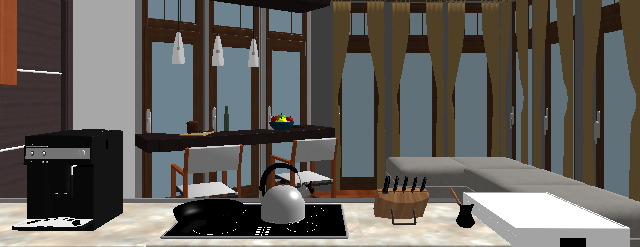
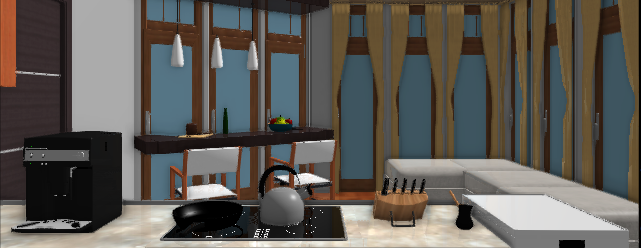
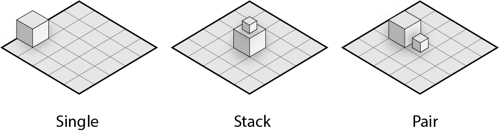

XWorld3D Python API
=================

# Introduction

This is an in-depth version python tutorial. For a quick start, check out the basic tutorial at `xrobot/README.md`

# Rendering
## Playground

The playground is essential to the simulation environment and rendering engine. Here we define the width and height of the virtual camera, and also select the rendering quality and assign it to a dedicated GPU (if you have a multi-GPU system)


Rendering Quality can be chosen between low and normal.  The low quality rendering is relatively fast and low memory usage, however, it only provides the most essential rendering functionalities. The normal quality rendering increase the contrast, reduces the jagged edges and enables the shadowfrom directional light but all these improvements will sacrifice the rendering speed. Exposure control is also available in normal rendering quality. To switch to low-quality mode, change the "RENDER_QUALITY_NORMAL" to "RENDER_QUALITY_LOW"

|          Low Quality         |            Normal Quality          |
|:----------------------------:|:----------------------------------:|
|  |  |


Headless context is used for rendering a scene without associating a window. To disable headless context, change the "HEADLESS" to "VISUALIZATION".

To create a playground, use `Playground(width, height, mode, quality, GPU)`

* Example:
```python
    your_playground = Playground(640, 480, HEADLESS, RENDER_QUALITY_NORMAL, 0)
```

# Scene

## Empty Scene

To create a completely empty scene without any building block, use `CreateEmptyScene()`

* Example:
```python
    your_playground.CreateEmptyScene()
```

## SUNCG Scene

To create a scene can load SUNCG JSON file, use `CreateSceneFromSUNCG()` and `LoadSUNCG(suncg_house_path, model_category_path, suncg_dir, filter)`

To remove doors or stairs while loading the scene, assign `REMOVE_DOOR` or `REMOVE STAIR` to the filter.

* Example:
```python
    your_playground.CreateSceneFromSUNCG()
    your_playground.LoadSUNCG(suncg_house, suncg_metadata, suncg_dir, REMOVE_DOOR)
```

## Testing Scene

To create a closed single room for testing, use `CreateArena(width, length)`.

* Example:
```python
    your_playground.CreateArena(3, 3)
```

## Randomly Generate Scene

To create a scene with randomly generate tiles, use `CreateRandomGenerateScene()`. Assets and room configuration also needs to be assigned before generating the room.

a) First, load the assets

```python
    door_assets = [door_asset_0, door_asset_1,...]
    key_assets  = [key_asset_0, key_asset_1,...]
    door_labels = [door_label_0, door_label_1,...]
    unlocked_door_asset = "./path/to/door/asset.json"
    unlocked_wall_asset = "./path/to/wall/asset.json"
    floor_assets = [floor_asset_0, floor_asset_1,...]
    your_playground.LoadBasicObjects(door_assets, key_assets, door_labels, \
        unlocked_door_asset, unlocked_wall_asset, floor_assets) 
    your_playground.LoadModels(goal_assets, goal_labels)
```

b) Next, load scene layout
```python
your_playground.LoadSceneConfigure(width, length, number_rooms, number_doors)
```

c) create a configuration for populating objects in the scene. The format must follow the example below:

* Example of creating a profile:
```python
    spawn_conf   = {"single" : [object_0, roomgroup_id, number,...], \
                    "stack"  : [object_1, object_2, roomgroup_id, number_on_top, number,...],
                    "pair"   : [object_3, object_4, roomgroup_id, number,...]
    }
```
There are three relationships between populated objects. 

 

* `single` means one object will be randomly populated at a time. 
* `pair` means a group consists of two objects populated close to each other.
* `stack` means a group consists of at least objects. When this populated, a large object usually at the bottom and many relativelly small object on the top of it.


d) Populate Objects

* Example of generating the rooms using a profile:

```python
    your_playground.SpawnModelsConf(spawn_conf)
    your_playground.SpawnModels()
```

For the tile arrangement, check out `xrobot/room_generator.cpp`.

## Load Object into Scene

* Example to load static scene:

```python
    position = [0, 0, 0]
    orientation = [1, 0, 0, 0]
    scale = 1
    your_playground.SpawnAnObject("room.obj", position, orientation, scale, "room", fixed)
```

* Example to load active rigid body object:

```python
    your_playground.SpawnAnObject("crate.obj", [0,0,0], [1,0,0,0], 1.0, "crate", False)
```

`fixed` defines the root node in the model whether or not treated as a static object and rest node will still be activated

**Be aware of orientation representation!** It uses valid quaternion for orientation! [0, 0, 0, 0] is invalid in quaternion!

# Reset and Initialize

## Reset Environment

This will remove any object in the environment including the camera.

* Example to reset the environment:

```python
    your_playground.Clear()
```

**Reset the scene before creating a new one!**

## Initialization

Initialize the scene. It tells the playground ready for rendering

* Example to reset the environment:

```python current orientation in 
    
    ## Generate Scene

    your_playground.Initialize()

    ## Simulation Loop

```

**Initialization before simulation start**

# Update

## Only Simulate One Step

* Example:

```python
    your_playground.UpdateSimulation()
```

* Example of simulating one step with actions applied :

```python
    actions = your_playground.UpdateSimulationWithAction(applied_action)
```

`applied_action` is an action id which uses to apply action before simulation step forward. You can get a list of action id use `GetActionSpace()`

The return value `actions` is a python dictionary with which special actions can be applied int next step.

The number of actions is limited to 10! It cannot execute any action id are larger than 10!

## Only Render One Frame

* Example:

```python
    your_playground.UpdateRenderer()
```

## Render and Simulate One Step

* Example:

```python
    your_playground.Update()
```

# Control

## Movement

Move the object or robot

* Example of Moving:

```python
    your_playground.MoveForward()
    your_playground.MoveBackward(scale)
```

The actual linear offset per step is 0.005 * `scale` and the linear offset per step is 0.005 unit.

* Example of Turning:

```python
    your_playground.TurnLeft()
    your_playground.TurnRight(scale)
```

The actual angular offset per step is 0.005 * `scale` and the angular offset per step is 0.005 rad.

* Example use `UpdateSimulationWithAction` to control the movement:

```python
    your_playground.UpdateSimulationWithAction(0) # Move Forward
    your_playground.UpdateSimulationWithAction(1) # Move Backward
    your_playground.UpdateSimulationWithAction(2) # Turn Left
    your_playground.UpdateSimulationWithAction(3) # Turn Right
```

## Camera Control

For the attached camera, the user only can control the pitch angle of the camera.

* Example:

```python
    your_playground.LookUp()
    your_playground.LookDown()
```

The actual pitch angle offset per step is 0.5 deg. And the angle will be clamped down in -45 to 45 deg.

* Example use `UpdateSimulationWithAction` to control the camera:

```python
    your_playground.UpdateSimulationWithAction(4) # Look Up
    your_playground.UpdateSimulationWithAction(5) # Look Down
```

## Joint Control

* Example of controlling joint position:

```python
    joint_position = {
        0 : 0.5,
        2 : 0.7,
        3 : 0
    }
    your_playground.ControlJointPositions(your_robot, joint_position, max_force)
```

`joint_position` is a python dictionary, and each entry is a pair of "joint id" and "joint position" 


* Example of controlling joint velocity:

```python
    joint_velocity = {
        0 : 4,
        2 : 5,
        3 : 0
    }
    your_playground.ControlJointVelocities(your_robot, joint_velocity, max_force)
```

`joint_velocity` is a python dictionary, and each entry is a pair of "joint id" and "joint velocity" 

## Grasp / Drop

Grasp or drop the object in the center of the camera (also within 3 unit length). Enable inventory before using "Grasp / Drop", check out "Inventory" for more details. 

* Example:

```python
    your_playground.Grasp()
    your_playground.PutDown()
```

* Example use `UpdateSimulationWithAction` to Grasp/Drop:

```python
    your_playground.UpdateSimulationWithAction(8) # Grasp
    your_playground.UpdateSimulationWithAction(9) # Drop
```

**Mix using Grasp / Drop and Attach / Detach is not recommended!**

## Attach / Detach

 Attach or detach the object root base at the center of the camera (also within 3 unit length).

* Example:

```python
    your_playground.Attach()
    your_playground.Detach()
```

* Example use `UpdateSimulationWithAction` to Grasp/Drop:

```python
    your_playground.UpdateSimulationWithAction(6) # Grasp
    your_playground.UpdateSimulationWithAction(7) # Drop
```

**Mix using Grasp / Drop and Attach / Detach is not recommended!**

## Teleport

Teleport an object or robot to a certain position in the scene

* Example:

```python
    teleport_to_position = [4, 0, 4]
    your_playground.Teleport(object, teleport_to_position)
```

## Rotate

Rotate an object a certain radius angles

* Example:

```python
    rotate_to = [0, 1.57, 0]
    your_playground.Rotate(rotate_to)
```

* Example use `UpdateSimulationWithAction` to rotate 90 degrees along world up vector:

```python
    your_playground.UpdateSimulationWithAction(10) # Rotate 90 deg along Y-Axis
```

## Actions

You can create two special types of object capable of changing its pose. Both of the two types need a JSON file to pre-define their behaviors.

1) The first type of object can transfer to another object instantly. The JSON file can be defined as:

* Example:

```json
    {
        "label" : "object label",
        "type" : "convert",
        "cycle" : false,
        "actions" : [
            { 
              "name" : "convert_to_crate",
              "object" : "./crate_0.3/crate.urdf"
            },
            { 
              "name" : "convert_to_apple",
              "object" : "./apple/apple.urdf"
            }
        ]
    }
```

You also can have more than two stages and convert it from one to the another.

2) The second type of object can change its joint pose smoothly. The JSON file can be defined as:

* Example:

```json
    {
        "label" : "object label",
        "type" : "animate",
        "object" : "/home/ziyuli/model/door.urdf",
        "joint_id" : 1,
        "actions" : [
            { 
              "name" : "open",
              "position" : 1.0
            },
            { 
              "name" : "close",
              "position" : 0.0
            }
        ]
    }

```

Currently, multi joints position assignment is not supported.

After you load those types of objects, you can use `TakeAction(id)` to them. However, `TakeAction(id)` is not working for a normal object.

* Example of Taking Action:

```python
    your_playground.TakeAction(my_crate, 1)
```

* Example use `UpdateSimulationWithAction` to take action:

```python
    available_action_to_target = your_playground.UpdateSimulationWithAction(ENABLE_INTERACTION) # Enable Interaction
    ## select an action from "available_action_to_target"
    ## we select action '0' for example
    your_playground.UpdateSimulationWithAction(0)  # Action 0
    your_playground.UpdateSimulationWithAction(DISABLE_INTERACTION) # Disable Interaction
```

You have to select a target first use `ENABLE_INTERACTION` before taking any action. Actions only can be executed after enabling interaction. `ENABLE_INTERACTION` will choose the target at the center of the virtual camera (also within 3 unit length). And after taking the action, use `DISABLE_INTERACTION` to deselect the target

# Query

## Intersection Between Two Object

Query two objects (Bounding Box) are intersecting

* Example:

```python
    result = your_playground.QueryObjectAABBIntersect(my_crate, my_agent)
```

## Object At Forwarding Direction

Query a certain object at virtual camera forward direction

* Example:

```python
    result = your_playground.QueryObjectWithLabelAtForward(my_object_label)
```

## Object At Virtual Camera Center

Query a certain object at virtual camera center. This will use ray-cast to test ray intersection with object concave or convex hull.

* Example:

```python
    result = your_playground.QueryObjectWithLabelAtCameraCenter(my_object_label)
```

* Example of Querying Object at Center Without Object Label:

```python
    my_object = your_playground.QueryObjectAtCameraCenter()
```

## Object Near Virtual Camera

Query a certain object is near to the virtual camera

* Example:

```python
    result = your_playground.QueryObjectWithLabelNearMe(my_object_label)
```

## Object Query

Return a list with all the object with certain label

* Example:

```python
    results = your_playground.QueryObjectByLabel(my_object_label)
```

# Sensor

## Attached Camera

The attached camera can be attached to a certain object in the scene. The camera will follow the object's translation and rotation. A translation offset can be applied.

* Example:

```python
    your_playground.AttachCameraTo(agent, [0, 2, 0])

    capture_rgbd = your_playground.GetCameraRGBDRaw()
```

**Currently, multi-cameras are not supported!**

## Free Camera

The free camera does not have any restrictions on translation and rotation.

* Example of creating a free camera:

```python
    your_playground.FreeCamera([0, 2, 0], yaw, pitch)

    capture_rgbd = your_playground.GetCameraRGBDRaw()
```

* Example of adjusting a free camera:

```python
    your_playground.UpdateFreeCamera([0, 3, 0], yaw + 1, pitch - 1)
```

**Currently, multi-cameras are not supported!**

## Single-Ray Lidar

Enable the lidar before using the single-ray lidar.

* Example of enabling the lidar:

```python
    num_pulses_per_scan_cycle = 120
    max_distance = 3 
    your_playground.EnableLidar(num_pulses_per_scan_cycle, max_distance)
```

* Example of updating the lidar:

```python
    result = your_playground.UpdateLidar(front_vector, up_vector, lidar_position)
```
The result is a list contains each ray's hitting distance. negative value means no-hit

**Currently, multi lidars are not supported!**

## Position and Orientation

You can get an object's (including robot's) position and orientation by using `GetPosition()` and `GetOrientation`

* Example:

```python
    
    agent.GetPosition()

    agent.GetOrientation()

```
`GetOrientation` returns current orientation in (x y z w). It uses normalized quaternion for orientation representation!

# Other Features

## Inventory

Inventory is robot temporary storage. Enable the inventory before using Grasp / Drop functions.

* Example:

```python
    your_playground.EnableInventory(max_capacity)
```

## Navigation Agent (Experimental)

Enable navigations to use path-finding for an object or robot. The range of the baking area is defined by two 'vectors'. The minimum y must smaller than the ground, and the maximum y cannot greater than the ceiling.

Path-finding relies on a grid map which is generated by a special depth camera on top of the scene. The range of the baking area needs to be passed into this member function.

Enable the navigation before using related functions.

* Example:

```python
    your_playground.EnableNavigation(min_corner, max_corner, kill_after_arrived)
    your_playground.AssignAgentRadius(0.2)
    your_playground.BakeNavigationMesh()

    nav_agent = your_playground.SpawnNavigationAgent("model.urdf", "label", position, orientation)
    your_playground.AssignNavigationAgentTarget(nav_agent, target_position)
```

For baking or re-baking the grid map for path-finding, use `BakeNavigationMesh()`

The surface threshold will be automatically calculated base on the major depth samples in the grid map. However, you may need to assign it by yourself in some scenario, use `AssignSurfaceLevel(0.2)`. The threshold is a log-based value between 0 to 1

In some cases, a large size agent cannot pass a small gap. You need to dilate the grid map to fill the gaps. A negative value for erodes the grid map. `AssignAgentRadius(0.1)`

For assigning a target to an agent, use `AssignNavigationAgentTarget(agent, [0,0,0])`. If an agent is no longer available, it will be neglected automatically.

For spawning an agent with the path-finding feature, use `SpawnNavigationAgent(...)`

**Currently, Navigation Agent orientation is incorrect! We will fix it in the future.**

# Miscellaneous

## Lighting

Adjust the basic light setting.

* Example:

```python

    my_playground.SetLighting({
        "ssr"      : False,
        "ambient"  : 0.1,
        "exposure" : 1.0
    })

```

Use key `direction_x`, `direction_y`, `direction_z` to update direction
Use key `ambient` to update ambient factor
Use key `exposure` to update exposure factor
Use key `ssr` to update screen space reflections

**"ssr" and "exposure" are normal rendering mode only!**

## Thing

Object or robot in the playground

* Example:

```python

    agent = my_playground.SpawnAnObject("husky.urdf", [0,0,0], [-1,0,0,1.57], 0.6, "Agent", True)

    ## Print the Label of the Thing
    ## console output: Agent
    print str(agent)

    print hash(agent)

    current_position = agent.GetPosition()

    current_orientation = agent.GetOrientation()

    my_label = agent.GetLabel()

    if agent == another_agent:
        print "They are the same!"

```

## Range

AABB struct

* Example:

```python
    
    object_range   = Range([0,0,0], [1,1,1])
    object_range_a = Range([0,0,0], [5,5,5])
    object_range_b = Range([1,1,1], [6,6,6])

    ## Print AABB
    ## console output: (0, 0, 0, 1, 1, 1)
    print str(object_range)

    aabb_min = object_range.GetMin()
    aabb_max = object_range.GetMax()

    if object_range_a == object_range_b:
        print "The AABBs between Object A and Object B are equal!"

    if object_range_a != object_range_b:
        print "The AABBs between Object A and Object B are intersect!"

    if object_range_a > object_range_b:
        print "The AABB of Object A contains the AABB of Object B!"

    if object_range_a < object_range_b:
        print "The AABB of Object B contains the AABB of Object A!"

```

**Be aware of "!=" between two range! The not equal operator is actually intersection test!**

## NavAgent

A special type of object or robot with navigation ability

* Example:

```python

    nav_agent = my_playground.SpawnNavigationAgent(model_path, "model_label", position, orientation)

    ## Print the Label of the Thing
    ## console output: model_label
    print str(nav_agent)

    if nav_agent == another_nav_agent:
        print "They are the same!"

```

## Get Observation and Action Space

* Example:

```python
    
    my_playground.GetObservationSpace()

    ## list of action id can be applied
    my_playground.GetActionSpace()

```

## Get Camera Status

You can retrieve position and orientation from the camera.

* Example:

```python
    
    my_playground.GetCameraPosition()

    my_playground.GetCameraFront()

    my_playground.GetCameraRight()

    my_playground.GetCameraUp()

    my_playground.GetNearClippingDistance()

    my_playground.GetFarClippingDistance()

```